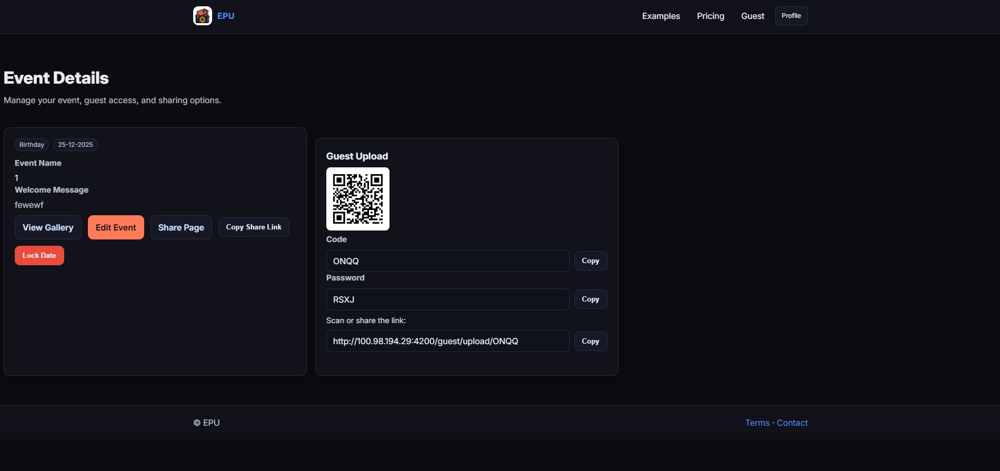

# ProjectEPU — Event Photo Uploads

A FastAPI web app where hosts create events and guests upload photos/videos via a shareable code or link. Hosts manage galleries, customize themes, and (later) pay for plans.

## Stack
- Backend: FastAPI, Starlette, Uvicorn
- Templating: Jinja2
- DB: SQLAlchemy (SessionLocal in db.py), SQL Server (via connection string)
- Auth: Cookie sessions, passlib[bcrypt]
- Frontend: HTML/CSS (static/*), minimal JS
- Email: aiosmtplib (via app/services/email_utils.py)
- Storage: Local filesystem under /storage

## Setup (Local, Windows)
1) Python env
- py -3 -m venv venv
- venv\Scripts\activate
- pip install -r requirements.txt
 - (optional, for development) pip install -r requirements-dev.txt

2) Environment
Create .env (or fill existing) with:
```
DB_SERVER=your-sql-server
DB_NAME=EPU
DB_USER=sa
DB_PASSWORD=secret
DB_DRIVER=ODBC Driver 17 for SQL Server

SECRET_KEY=replace-with-long-random
BASE_URL=http://localhost:4200

GMAIL_USER=youraddress@gmail.com
GMAIL_PASS=your-app-password

STRIPE_PUBLISHABLE_KEY=pk_test_xxx
STRIPE_SECRET_KEY=sk_test_xxx
STRIPE_WEBHOOK_SECRET=whsec_xxx  # optional but recommended for webhook verification

# Support/Contact
SUPPORT_EMAIL_TO=support@example.com

# Optional CAPTCHA gate for /contact (set if using Turnstile/hCaptcha and pass token to captcha_token)
CAPTCHA_SECRET=your-captcha-secret

# Optional Redis for shared rate limiting (format: redis://:password@host:port/0)
REDIS_URL=redis://:password@127.0.0.1:6379/0
```

2.5) Database migrations
- Initialize/update schema with Alembic:
- alembic upgrade head

3) Run
- uvicorn main:app --host 0.0.0.0 --port 4200 --reload

Optional (seed themes/types/plans):
- python -m app.db_seed_themes
- python .\app\db_seed_plans.py

## Logging & Observability
- Request logging is enabled with JSON output and request IDs. Configure via .env:
```
LOG_LEVEL=INFO           # DEBUG/INFO/WARNING/ERROR/CRITICAL
LOG_JSON=true            # json logs to console and file
LOG_FILE=logs/app.log    # rotating file path
LOG_MAX_BYTES=5000000    # 5MB per file
LOG_BACKUP_COUNT=5       # number of rotated files to keep

# Optional Sentry error reporting
SENTRY_DSN=
SENTRY_TRACES_SAMPLE_RATE=0.0  # set 0.1..1.0 to enable performance tracing
```

## Security Settings
- COOKIE_SECURE=true        # Force `Secure` on session cookie (auto-enabled if BASE_URL starts with https)
- MAX_UPLOAD_BYTES=200000000  # Per-file size limit (bytes)
- ALLOWED_UPLOAD_MIME_PREFIXES=image/,video/  # Comma-separated prefixes

Optional content sniffing:
- If you install `python-magic` (or python-magic-bin on Windows), uploads and event assets use server-side MIME sniffing to validate actual content.

- Every response includes an `X-Request-ID`. 404/500 pages also set it; 500 shows it on-page.
- Audit logs write to the same loggers under the name `audit` for key actions like login, signup, verify, logout, and guest uploads.
- Admin access is controlled by `Users.IsAdmin` (set via DB/migration). Admin-only routes live under `/admin*`.

### Rate limiting (Redis-enabled)
- Login and contact forms are protected by rate limits. By default, limits are in-memory per-process.
- If `REDIS_URL` is set in `.env`, limits are enforced using Redis, so they work across multiple app instances.
- Tunables (defaults shown) are set in `app/core/settings.py` and can be overridden via `.env`:
  - RATE_LIMIT_LOGIN_ATTEMPTS=5, RATE_LIMIT_LOGIN_WINDOW_SECONDS=900
  - CONTACT_RATE_LIMIT_ATTEMPTS=3, CONTACT_RATE_LIMIT_WINDOW_SECONDS=60

## Directory Overview
- main.py — app setup + router includes + static mounts
- app/api/* — modular routers (auth, profile, events, uploads, gallery, etc.)
- app/models/* — SQLAlchemy models (user, event, billing, etc.)
- app/services/* — auth, email, metadata helpers
- templates/* — Jinja2 pages
- static/* — CSS/JS/assets
- storage/* — uploaded media

See also: User Journeys and Action Catalog — USER_JOURNEYS.md

---

## GDPR — Download my data (export)

Users can request a portable export of their account data (JSON manifest in a ZIP). Media files are not included.

What’s included
- Account profile (name, email, created/updated)
- Your events (ID, name, code, date, published)
- File metadata for your events (name, type, size, timestamps, GPS, checksum, deleted flag)
- Favorites (your starred files)
- Guest messages on your events
- Email preferences
- Purchases and payment log metadata (no full Stripe payloads)

How to use
- Go to Profile → Edit profile
- Click “Request export”
- Once ready, click “Download ZIP”

Implementation details
- A `UserDataExportJob` record tracks status: queued → running → completed/failed
- The export writes `manifest.json` into a ZIP at `storage/exports/{UserID}/user_{UserID}_export_*.zip`
- Links expire after 7 days; regenerate any time
- Endpoints:
  - POST /profile/export/request (CSRF-protected)
  - GET /profile/export/download (returns application/zip)

Notes
- Only structured data is exported; uploaded media is not included in this export
- Admins cannot download another user’s export from these endpoints

## Roadmap and MVPs

### Phase 0 — Stabilize and Unify (Now)
Goals
- Single DB/session pattern via dependency injection.
- Single auth/session pattern.
- Consistent layout; all main links work.

Tasks
- [x] Central DB dependency: use db.get_db() in all routers; remove per-file engine/sessionmaker.
- [x] Auth dependency: get_current_user() (and optional require_user()) returns User or redirects.
- [x] Settings: centralize config using Pydantic BaseSettings; load from .env once.
- [x] Routes audit: ensure these routes resolve:
  - /, /login, /signup, /verify, /logout
  - /profile, /profile/edit
  - /events, /events/create, /events/{id}, /events/{id}/edit
  - /guest/login, /guest/upload/{code}
  - /gallery
  - /plans (pricing)
  - /billing (alias to /plans)
  - /terms
  - /e/{code} (public share page)
  - /robots.txt, /sitemap.xml
  - /qr
  - /health, /health.txt
- [x] Layout: header has fixed height; main { padding-top: headerHeight } once; remove ad-hoc top gaps.
- [x] Static fixes: remove unused global CSS (e.g., playground.css) from base; fix gallery.css/js syntax.
- [x] Errors: add friendly 404/500 templates; explicit 303 on POST redirects.
- [x] Logging: basic logging config; include request path and user/session where available.
- [x] Security quick wins: cookie flags (httponly, samesite=Lax, secure in prod); upload MIME/size validation; safe filenames.

Acceptance
- App runs without runtime errors.
- All listed routes return a page (placeholders ok).
- Consistent top spacing across pages.

---

### MVP 1 — Accounts and Sessions
Goal
- Sign up, verify email, log in, log out; protected profile area.

Build
- [x] Signup form + create user.  (basic password policy enforced; in place)
- [x] Email verification (no-op in dev if creds missing, but token checked).
- [x] Login with rate-limiting and basic password policy.  (in-memory limiter; replace with Redis for multi-instance)
- [x] Session create/get/deactivate; rotate on login; expiry respected.

Acceptance
- New user signs up -> verify -> log in -> see /profile.
- Unverified cannot log in.
- Logout clears session and denies /profile.

---

### MVP 2 — Event Creation and Guest Upload
Goal
- Hosts create events; guests upload via code/password.

Build
- [x] Create Event (GET/POST) with generated guest code.
- [x] Event Details: show code, share link, QR.
- [x] Guest Login: event code (+ optional password).
- [x] Guest Upload: multiple files; save under storage/{userId}/{eventId}/; persist FileMetadata.
- [x] Metadata extraction for images/videos (best-effort, non-blocking).

Acceptance
- Host creates event, sees code + QR.
- Guest can upload; files stored and visible in DB.

---

### MVP 3 — Gallery & Management
Goal
- Browse, slideshow, download, soft delete/restore.

Build
- [x] Event gallery grid.
- [x] Lightbox/slideshow; filter by type.
- [x] Download selected or zip-all.
- [x] Soft delete flag; undo.
- [x] Favorites (mark/unmark; toggle favorites-only view).

Acceptance
- All uploaded files are visible and manageable.
- Download-all streams a zip.

---

### MVP 4 — Themes and Customization
Goal
- Visual customization for event/guest pages.

Build
- [x] Seed Themes; EventCustomisation supports ThemeID or custom colors.
- [x] Edit Event: pick theme to auto-fill preview; save ThemeID/custom.
- [x] Apply theme to guest upload and event pages.
 - [x] Shared theme variables/styles (theme.css + _theme_vars.html) for exact parity across editor/guest/share pages.
 - [x] Floating label forms across all pages for consistency.

Acceptance
- Selecting a theme updates UI and persists; guest pages reflect the theme.

---

### MVP 5 — Plans and Payments
Goal
- Paid plans for higher limits.

Build
- [x] Pricing page; Stripe checkout session.
- [x] Webhook: mark purchase complete; assign plan to user.
- [x] Enforce plan limits (uploads/storage/features).

Acceptance
- User purchases a plan; plan recorded; limits enforced.

---

### MVP 6 — Admin & Support
Goal
- Operability and moderation.

Build
- [x] Basic billing views: purchases and payment logs (admin-only routes).
 - [x] Admin dashboard: users, events, usage stats, search.
 - [x] Audit logs for key actions (export from logs).
 - [x] Contact/support flow (email to support inbox with rate limiting/CAPTCHA hook).

Acceptance
- Admin can view stats and export audit logs.

---

## Next Roadmap (Proposed)

1) Admin & Operability polish
- [x] Admin user management page: promote/demote `IsAdmin` securely
- [x] Dashboard filters/pagination; link through to user/event detail views
- [x] Audit log filter/export by time/type; redact sensitive fields
  - [x] Theme changes are audited (who/when/what) in logs and DB (ThemeAudit)

2) Security & Abuse mitigation
- [x] Real CAPTCHA verification (Turnstile/hCaptcha) server-side for `/contact` and sensitive forms
- [x] Replace in-memory rate limits with Redis (shared across instances)
- [x] CSRF tokens on form POSTs where applicable

3) Storage & Media
- [ ] Signed URLs / authenticated media download; hide direct `/storage` in prod
- [ ] Background metadata extraction workers; retry on failure
- [ ] Optional image/video transcoding pipeline
 - [ ] S3/Blob storage backend option with CDN
 - [ ] Smarter duplicate detection and surfacing in UI

4

5) Testing & Quality
- [ ] Expand pytest coverage (auth flows, upload edge cases, billing webhooks)
- [ ] mypy typing for services/models; enforce in CI
- [ ] E2E smoke with Playwright (optional)

6) Deployment & Observability
- [ ] Systemd timers for backups (DB + storage); restore playbooks
- [ ] Sentry performance sampling on key routes
- [ ] Structured audit exporter (ndjson) with rotation
 - [ ] Access logs and dashboards (Grafana/Prom) for usage insights

7) SEO & Accessibility
- [ ] Open Graph/Twitter card optimization for share pages
- [ ] Ensure sitemap includes public events; add lastmod where practical
- [ ] WCAG AA color contrast checks and keyboard navigation across forms and gallery

## Engineering Enablers
- [ ] Alembic migrations; generate initial revision for all models.
- [ ] Tests:
  - pytest + FastAPI TestClient for auth, events, uploads
  - Unit tests for metadata utils
- [ ] Tooling:
  - Black + Ruff; pre-commit hook
  - mypy on services/models (where practical)
- [ ] Deployment:
  - Dockerfile or systemd + Nginx
  - Prod env secrets; backups for storage and DB
- [ ] Observability:
  - Error reporting (Sentry optional)
  - [x] Health endpoint: GET /health -> 200

### Dev tooling & migrations
- Pre-commit hooks:
  - pip install -r requirements-dev.txt
  - pre-commit install
- Format/lint:
  - black .
  - ruff check --fix .
- Alembic:
  - alembic revision --autogenerate -m "init"
  - alembic upgrade head

### Deployment options
- Docker:
  - docker build -t epu:latest .
  - docker run -p 4200:4200 --env-file .env epu:latest
- Systemd + Nginx (templates in deploy/):
  - Copy project to /opt/epu and create venv
  - Install requirements and configure .env
  - Install deploy/epu.service and enable
  - Deploy deploy/nginx.conf and reload Nginx

---

## Route Coverage Checklist
- [x] GET /           -> redirect to /events or /profile (if logged in)
- [x] GET /login      -> log_in.html
- [x] POST /auth/login
- [x] GET /signup     -> sign_up.html
- [x] POST /auth/signup
- [x] GET /verify     -> verify_notice.html
- [x] GET /logout
- [x] GET /profile    -> profile.html (protected)
- [x] GET /profile/edit -> edit_profile.html (protected)
- [x] GET /events           -> events_dashboard.html (protected)
- [x] GET /events/create    -> create_event.html (protected)
- [x] POST /events/create
- [x] GET /events/{id}      -> event_details.html (protected)
- [x] GET/POST /events/{id}/edit (protected)
- [x] GET /gallery          -> gallery.html (protected)
- [x] GET /guest/login      -> guest_log_in.html
- [x] GET/POST /guest/upload/{code} -> guest_upload.html
- [x] GET /plans            -> pricing.html
- [x] GET /billing          -> pricing.html (alias to /plans)
  Admin
  - [x] POST /admin/refund
  - [x] POST /admin/cancel
- [x] GET /terms            -> terms.html
- [x] GET /e/{code}         -> share_event.html
- [x] GET /qr               -> PNG QR generator
- [x] GET /robots.txt       -> robots
- [x] GET /sitemap.xml      -> sitemap
- [x] GET /health, /health.txt
- [x] GET /favicon.ico

---

## UI Consistency
- Header: fixed height (e.g., 72px); Main: padding-top: 72px single source of truth.
- Avoid page-specific top margins; prefer utility spacing classes.
- Components: use templates/components/button.html for CTAs.
- Forms: use unified floating-label inputs.
- Themes: rely on shared theme.css + _theme_vars.html for exact visual parity across pages.

---

## Open Questions
- Do we want to hide /storage and serve files via signed/auth URLs?
- Which video formats are allowed and transcoding needs?
- Stripe: one-time vs subscription plans; regional taxes.

---

## Working Notes
- In dev, email sending can no-op if GMAIL creds are not set; verification token flow should still work locally (displayed/logged).
- Large file uploads: consider 100–200 MB limit; configure Uvicorn/Starlette limits accordingly.

### Logging & Request IDs
- Configure log level via `.env` using `LOG_LEVEL=DEBUG|INFO|WARNING|ERROR` (default: INFO).
- Every HTTP request is assigned a request ID and emitted in logs; the same ID is returned in the `X-Request-ID` response header.
- 404/500 handlers also include `X-Request-ID`; the 500 page shows the ID for support correlation.

Examples (INFO):
```
2025-08-18 12:00:01,234 INFO app request.start method=GET path=/profile request_id=... user_id=4
2025-08-18 12:00:01,290 INFO app request.end method=GET path=/profile status_code=200 duration_ms=56 request_id=... user_id=4
```

---

## Contributing
- Use feature branches; open PRs referencing checklist items.
- Run format/lint before commit (Black/Ruff).
- Add/adjust tests for each feature.

### CI hint
- Production deployments should install only `requirements.txt`.
- For CI/test pipelines, install both `requirements.txt` and `requirements-dev.txt` to run tests and linters.
